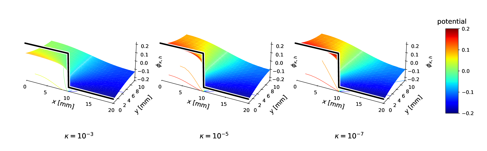
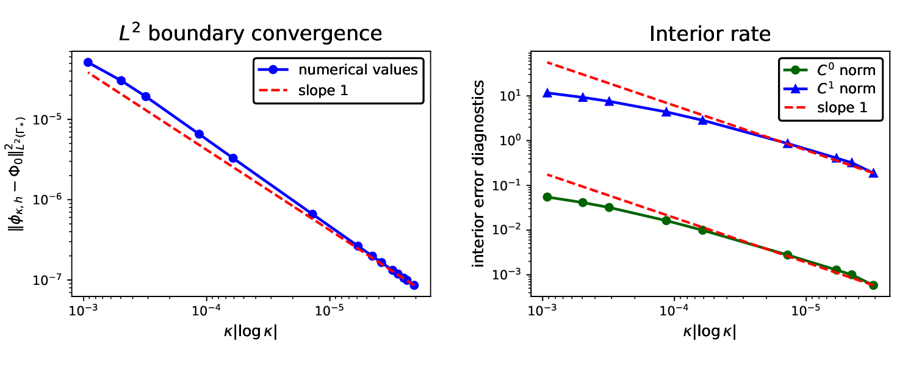
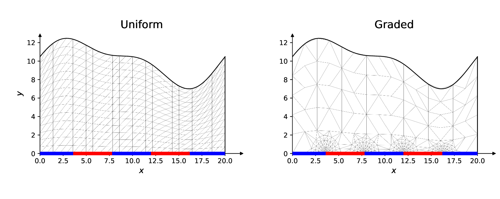
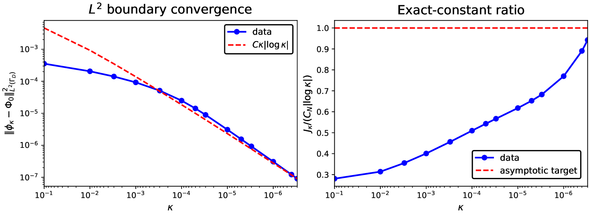
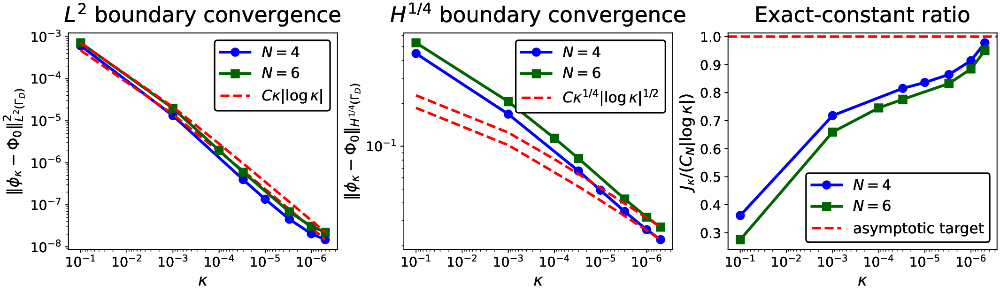

# Singular-limit in corrosion modeling

Finite-element experiments for the singular limit of a nonlinear elliptic
problem arising in electrochemistry. This repository accompanies the paper and
is written as a mathematical numerical study: the recommended entry point is
the guided notebook [`numerical_experiments.ipynb`](numerical_experiments.ipynb).

<p align="center">
  <a href="paper_figures/kappa_evolution_3d_single.pdf">
    
  </a>
</p>

As the conductivity parameter $\kappa$ decreases, the reactive boundary trace
sharpens toward the cathode--anode step data. Away from the junction, the bulk
solution approaches the mixed harmonic extension. Click any plot in this
README for its vector PDF.

## Analytical model for corrosion

For a domain $\Omega\subset\mathbb{R}^2$ with cathodic and anodic boundary
parts $\Gamma_c$ and $\Gamma_a$, the potential $\phi_\kappa$ is harmonic in the
electrolyte and satisfies nonlinear Butler--Volmer flux conditions:

$$
-\Delta\phi_\kappa=0 \quad\text{in }\Omega,
\qquad
\partial_\nu\phi_\kappa=-\frac{i_c(\phi_\kappa)}{\kappa}
\quad\text{on }\Gamma_c,
\qquad
\partial_\nu\phi_\kappa=-\frac{i_a(\phi_\kappa)}{\kappa}
\quad\text{on }\Gamma_a.
$$

The experiments examine the limiting step trace $\Phi_0$, its mixed harmonic
extension $u_0$, and the logarithmic energy law

$$
J_\kappa(\phi_\kappa)
=C_N|\log\kappa|+O(\log|\log\kappa|),
\qquad
C_N=\frac{N(\phi_c-\phi_a)^2}{2\pi},
$$

where $N$ is the number of smooth cathode--anode junctions.

The numerical study tests four predictions:

1. the nonlinear boundary trace converges to the discontinuous equilibrium
   profile;
2. the interior solution converges to the mixed harmonic extension;
3. each smooth junction contributes the predicted local logarithmic energy;
4. the smallest mesh scale near a junction must be comparable with $\kappa$.

## Start with the notebook

Clone the repository and enter its folder:

```bash
git clone https://github.com/danielfdzm/singular-limit-corrosion.git
cd singular-limit-corrosion
```

Install the dependencies:

```bash
python -m pip install -r requirements.txt
```

Then open the guided presentation:

```bash
jupyter lab numerical_experiments.ipynb
```

The notebook runs immediately with the included tables and figures. Leave
`RECOMPUTE = False` for a quick, self-contained tour of the mathematics and
results. Set it to `True` only when a complete and potentially long sequence of
nonlinear finite-element solves is intended.

## Numerical highlights

### Boundary and interior selection

<p align="center">
  <a href="paper_figures/theorem_dashboard.pdf">
    
  </a>
</p>

The squared boundary $L^2$ error follows the predicted
$\kappa|\log\kappa|$ scale, while compact-interior diagnostics decay toward the
mixed harmonic reference. The plotted values are available in
[`data/summaries`](data/summaries/).

### Why junction grading matters

<p align="center">
  <a href="paper_figures/mesh_strategy_triptych.pdf">
    
  </a>
</p>

A uniform mesh spends most of its nodes away from the singular layer. The
graded construction concentrates resolution at the reactive junctions, where
the order-$\kappa$ transition and logarithmic energy cost are generated.

### Geometry and parameter robustness

| Corrugated six-junction domain | Practical electrochemical ratios |
|:--:|:--:|
| [](paper_figures/corrugated_six_junction_diagnostics.pdf) | [](paper_figures/practical_stainless_zro2_corrugated_diagnostics.pdf) |

The leading junction law is also tested on corrugated domains and under
parameter ratios fitted for ZrO$_2$-coated stainless steel in NaCl. These are
robustness checks rather than a material calibration.

## Reproduce the computations

A short two-value single-junction check is:

```bash
python -m scripts.reproduce_paper short-check
```

The complete paper-figure sequence is:

```bash
python -m scripts.reproduce_paper paper-figures
```

To inspect the six stages without starting the computations:

```bash
python -m scripts.reproduce_paper paper-figures --dry-run
```

Fresh solution arrays and tables are written to `data/computed/`; fresh plots
are written to `paper_figures/generated/`. These folders are created on demand
and ignored by version control. The included summaries and manuscript figures
are never overwritten.

## Repository guide

```text
singular-limit-corrosion/
├── numerical_experiments.ipynb   step-by-step mathematical presentation
├── scripts/                      finite elements, solvers, diagnostics, plots
├── data/                         included numerical tables and metadata
├── paper_figures/                manuscript PDFs and GitHub-ready PNGs
├── requirements.txt
└── README.md
```

The shortest route through the numerical method is
[`model.py`](scripts/model.py) $\rightarrow$ [`mesh.py`](scripts/mesh.py)
$\rightarrow$ [`nonlinear_solver.py`](scripts/nonlinear_solver.py).

- `model.py`, `mesh.py`, and `nonlinear_solver.py` define the problem, assemble
  the finite-element discretization, and solve the nonlinear minimization.
- `experiments.py`, `mesh_studies.py`, and `postprocess.py` run the studies and
  form the paper-facing comparisons.
- `diagnostics.py`, `numerical_analysis.py`, and `solution_plots.py` compute the
  errors, regressions, energy constants, and figures.
- `notebook_helpers.py` and `reproduce_paper.py` keep the notebook and complete
  reproduction workflow concise.

See [`data/README.md`](data/README.md) for the included numerical records and
[`paper_figures/README.md`](paper_figures/README.md) for the complete figure
index.

## License

The repository is released under the [MIT License](LICENSE).
